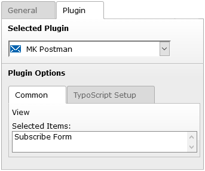
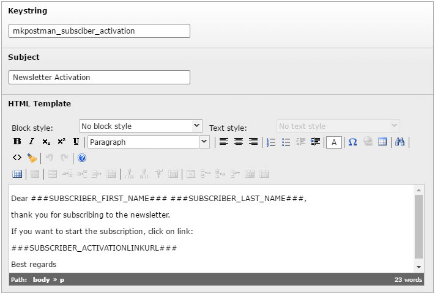

MK POSTMAN
==========

e-mail marketing system for the TYPO3 CMS TYPO3.

Subscription
------------

To use plugins you has to include the static typoscript *MK Postman (Base)* in your template.

For mail subscription there are a MK Postman plugin called *Subscibe Form*.  
You can simply add this by ading a new contentelement,
choosing *MK Postman* in the *Plugins* section of the wizard
and select *Subscibe Form* in the view section.



Depending to your styles the frontend output should look like this:


On subscribe the Data will be stored in the database and a double-opt-in mail will be send automaticaly.

For the e-mail the powerful 
[MK Mailer](https://github.com/DMKEBUSINESSGMBH/typo3-mkmailer/) extension is used.

But at first you has to create the e-mail template by your self!

### Mail Template

For the double-opt-in mail you has to create a MK Mailer Email-Template.

Important: the *Keystring* of the Template has to be *mkpostman_subsciber_activation*.



In the template currently the following markers available:

 * ###SUBSCRIBER_DCNAME###  
   a combination of the gender, first- and last name (Mr. John Doe)
 * ###SUBSCRIBER_FIRST_NAME###  
   the first name from the subscribe form
 * ###SUBSCRIBER_LAST_NAME###  
   the last name from the subscribe form
 * ###SUBSCRIBER_EMAIL###   
   the email the subscribe form
 * ###SUBSCRIBER_ACTIVATIONLINKURL###  
   the activation url
 * ###SUBSCRIBER_ACTIVATIONLINK###  
   the link with tags as wrap

### Form Templating

There are currently two ways to build the form, which you can select in the MK Postman Plugin.

You can use the powerful
[MK Forms](https://github.com/DMKEBUSINESSGMBH/typo3-mkforms/) extension or the build in fluid form.

#### Standalone

The standalone Subscription Form comes with a Fluid Template

The Template and The Partial with the all formular elements are defined in the Template.

```
plugin.tx_mkpostman.subscribe.template.file = EXT:mkpostman/Resources/Private/Templates/Frontend/Templates/Subscribe.html
```

Note, that all fields with the prefix *mkpostman[subscriber]* will be stored in the
table *tx_mkpostman_subscribers*. All other fields will be ignoren on process.

#### MK Forms

When you use the MK Forms integration, the form is based on a xml. This form xml is configured by TS and can be overridden:

```
plugin.tx_mkpostman.subscribe.xml = EXT:mkpostman/Resources/Private/Form/Subscribe.xml
```

All formular elements and the template are defined there.

Note, that all fields with the prefix *subscriber-* will be stored in the
table *tx_mkpostman_subscribers*. All other fields will be ignoren on process.

### Subscription confirm

After the subscription form was surefully submitted,
there will be a redirect to a confirm page.  
By default the same page as the current subscription form will be used.
For the legacy marker template the subpart *###SUBSCRIBE_SUCCESS_SUBSCRIBE###* of the subscribe-template will be outputted.
For the new Fluid template the SubscribeSuccess partial will be outputted.
A diffrent page for the redirect after the form submit can be defined in TypoScript

```
plugin.tx_mkpostman.subscribe.redirect.subscribe.pid = 7
```

### Activation confirm

After the activation link from the double-opt-in mail was processed by MK Postman,
there will be a redirect to a confirm page.  
By default it is the same page as the current activation page
For the legacy marker template the subpart *###SUBSCRIBE_SUCCESS_ACTIVATE###* of the subscribe-template will be outputted.
For the new Fluid template the ActivateSuccess partial will be outputted.  
A diffrent page for the redirect after the form submit can be defined in TypoScript

```
plugin.tx_mkpostman.subscribe.redirect.activate.pid = 5
```

In case of activation failure the subscribe form will be rendered currently.

